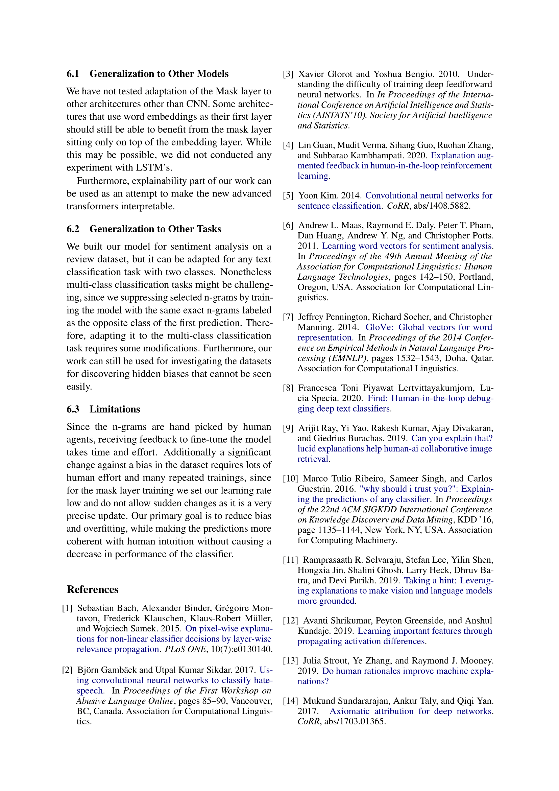

# Suppressing-word-bias-with-Human-in-the-Loop

## TUM - XAI Lab course

Code is provided as .ipynb notebook and can directly be used in Google Colab.
All the project code is under CNN_Sentiment_Analysis.ipynb

**Note:** _For structured and easy navigation using "Table of contents" section of GoogleColab is Highly recommended._

## Abstract

Using Deep Neural Networks for sentiment analysis is shown great performance in the recent years by outperforming many classical methods Kim (5). Although their potential is promising, to train them perfectly one needs a perfect dataset. A perfect dataset in theory is a completely unbiased dataset that contains each and every word of a vocabulary with all possible combinations. Since getting such a dataset is practically impossible, classifiers are likely to learn some of the imperfections contained within the dataset. The resulting model therefore will contain dataset bias. To the extend of our knowledge deep learning models are mostly considered black box there is no direct method to make the model unlearn something. In this paper we propose Masking Layers to deal with this problem, a new type of layer that has a single purpose, dampen or enhance. This layer allows humans clear out some of the models imperfections. Experiments show that by using Masking Layers humans can force the model to dampen its faultily learned features thus suppressing the model bias to some extend.

[Download full report in PDF format][pdf]

## How to run

Open the notebook "CNN_Sentiment_Analysis.ipynb" using GoogleColab
You can go with the following approaches:

- Most Minimalistic approach
- Full run

---

## Most Minimalistic approach

Click **Runtime -> RunAll**

_Notes:_

- _Pre-selected human feedbacks will be used and therefore may not produce the best scores._
- _Will not mount googledrive and therefore repetitive runs will not benefit from pre-downloaded dataset & embeddings, thus taking a long time to at each run_

---

## Full run with User Interactions approach

1. Set the `use_gdrive` parameter in the first line to `true`

   ```python
   use_gdrive = True
   ```

2. Set the target root folder under GoogleDrive

   ```python
   gdrive_path = "XAI"
   ```

3. Set the `ask_user_feedback` parameter under User Feedback sub header to `true`

   ```python
   ask_user_feedback = True
   ```

4. Enter desired number for feedback generation under User Feedback sub header eg.

   ```python
   num_positive_words = 100
   num_negative_words = 100
   ```

5. Click **Runtime -> RunAll**
6. Authorize GoogleDrive when it is asked

---

Training of the Embedding Mask Layer for 100 epochs with 100 positive and 100 negative word feedbacks:

<https://user-images.githubusercontent.com/5883288/145028356-b7c92261-e8b7-4353-9e6d-1ca7d312558d.mp4>

---

## Report

|                                          Page 1                                          |                                         Page 2                                         |
| :--------------------------------------------------------------------------------------: | :------------------------------------------------------------------------------------: |
|  |  |

|                                          Page 3                                          |                                         Page 4                                         |
| :--------------------------------------------------------------------------------------: | :------------------------------------------------------------------------------------: |
|  |  |

|                                          Page 5                                          |                                         Page 6                                         |
| :--------------------------------------------------------------------------------------: | :------------------------------------------------------------------------------------: |
|  |  |

|                                          Page 7                                          |                                         Page 8                                         |
| :--------------------------------------------------------------------------------------: | :------------------------------------------------------------------------------------: |
|  |  |

|                                          Page 9                                          |                                        Page 10                                         |
| :--------------------------------------------------------------------------------------: | :------------------------------------------------------------------------------------: |
|  |  |

[//]: # "These are reference links used in the body of this note and get stripped out when the markdown processor does its job. There is no need to format nicely because it shouldn't be seen. Thanks SO - http://stackoverflow.com/questions/4823468/store-comments-in-markdown-syntax"
[pdf]: https://github.com/kaanoguzhan/Suppressing-word-bias-with-Human-in-the-Loop/raw/main/Report/Suppressing%20word%20bias%20with%20Human-in-the-Loop.pdf
